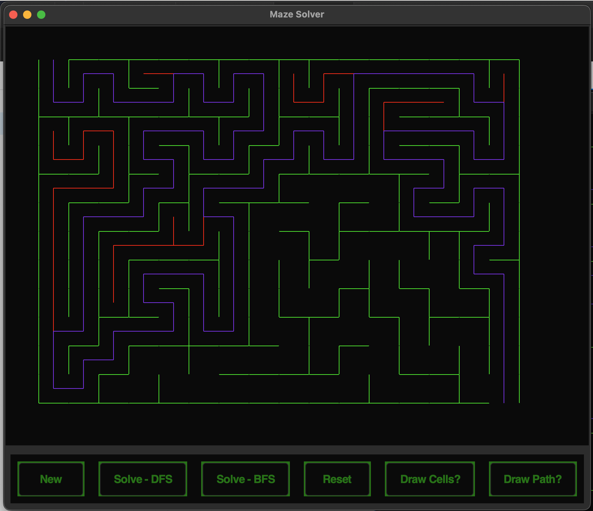

---------------------------

## Maze Maestro - tkinter maze solver and visualizer

- improvements:
- resize grid functionality
- refactor from recursive to stack/queue solving/drawing functions to handle bigger mazes without recursion overflow
- control maze animation back/forwards with arrow keys
- solve maze game
- compete in maze game against algorithm
- side by side representation of different algorithms
- add more algorithms e.g. a\*
